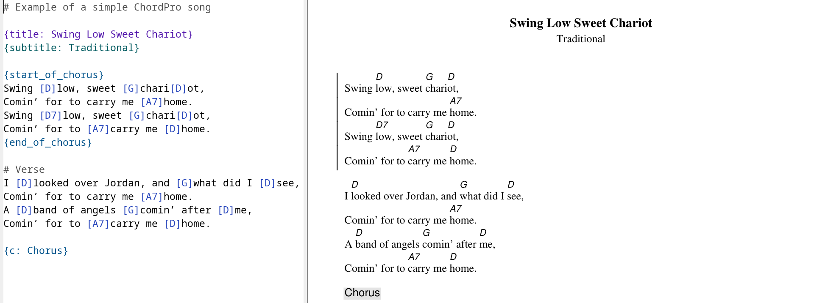

# ChordPro mode

## Introduction

Emacs major mode for editing files in the [ChordPro
format](https://www.chordpro.org/chordpro/chordpro-introduction/).

## Installation

Clone this repository, then manually install `chordpro-mode` with `M-x
package-install-file`.

## Usage

Files with the `.cho` extension will automatically be opened with `chordpro-mode`.

### Editing

* `[`     : Insert a chord at point. Brackets will automatically be
  inserted, space trimmed, and the chord capitalized. (To insert a
  literal `[` characters, use `C-q [`)
* `C-c w` : Kill the chord at point.
* `C-c z` : Kill the next chord after point.
* `C-c r` : Replace the chord at point with another chord.
* `C-c c` : Copy the chord at point
* `C-c x` : Copy the next chord
* `C-M-n` : Move chord at point forward PREFIX chars.
* `C-M-p` : Move chord at point backward PREFIX chars
* `C-c m` : Insert a comment directive
* `C-c h` : Insert a chorus directive
* `C-c t` : Insert a title directive
* `C-c s` : Insert a subtitle directive
* `C-c C-c` : Export ChordPro file to PDF

### Export to PDF

If the `chordpro` command is in your `$PATH` ([installation
instructions](https://www.chordpro.org/chordpro/ChordPro-Installation.html)),
`M-x chordpro-export` will export the current ChordPro buffer to PDF.

### Live export

This hook runs `chordpro-export` each time you save the buffer:

```
(add-hook 'after-save-hook #'chordpro-export nil t)
```

You can get a live preview of the exported PDF if you run an PDF
viewer like [Zathura](https://pwmt.org/projects/zathura/) which
automatically re-renders the document when the underlying file
changes:



## Changelog

### 2.0

- Forked in 2023
- Add `chordpro-export` function
- Remove broken mouse keybindings
- Use thingatpt for chords
- Clean up obsolete code
- Add `.cho` to auto-mode-alist

### 1.0

- Initial version created by Howard Ding in 2014
